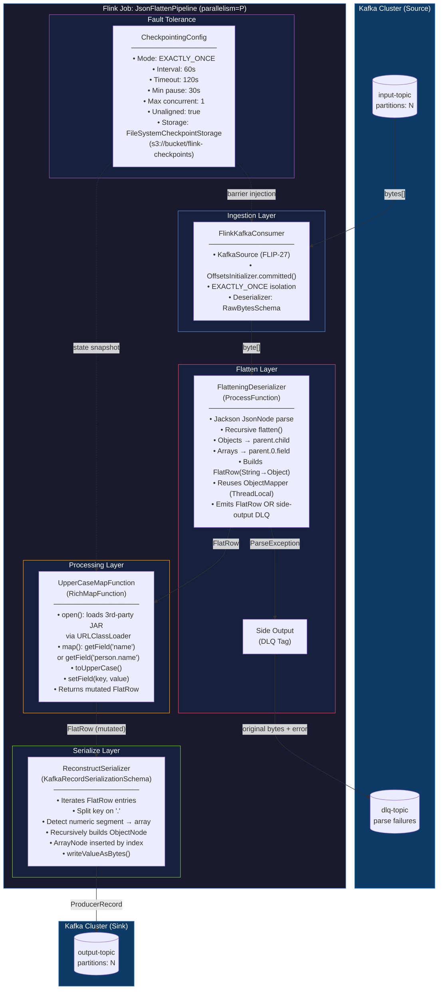
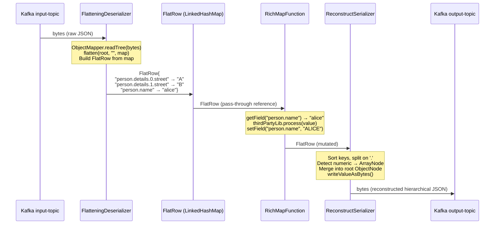

# Apache Flink 1.20.3 Hierarchical JSON Flattening Pipeline

---

## 1. Mermaid Architecture Diagram



---

## 2. Data Flow & Type Contract



---

## 3. Flattening Algorithm — Pseudocode

```
ALGORITHM: flatten(JsonNode node, String prefix, Map<String,Object> out)
═══════════════════════════════════════════════════════════════════════════

INPUT:  node   — current JsonNode (ObjectNode | ArrayNode | ValueNode)
        prefix — accumulated dot-path (empty string at root)
        out    — mutable output map (insertion-ordered LinkedHashMap)

OUTPUT: out populated with dot-notation key → scalar value entries

────────────────────────────────────────────────────────────────────────

PROCEDURE flatten(node, prefix, out):

  IF node IS ObjectNode THEN
    FOR EACH fieldEntry IN node.fields():
      childKey  ← IF prefix IS EMPTY
                    THEN fieldEntry.key
                    ELSE prefix + "." + fieldEntry.key
      flatten(fieldEntry.value, childKey, out)    // recurse

  ELSE IF node IS ArrayNode THEN
    FOR index FROM 0 TO node.size() - 1:
      childKey ← prefix + "." + index             // e.g. "items.0"
      flatten(node.get(index), childKey, out)      // recurse

  ELSE                                             // ValueNode (leaf)
    value ← CASE node.nodeType OF
               NUMBER  → node.numberValue()        // preserve Long/Double
               BOOLEAN → node.booleanValue()
               NULL    → null
               DEFAULT → node.asText()
    out.put(prefix, value)

────────────────────────────────────────────────────────────────────────

EXAMPLE TRACE:
  Input: {"person":{"name":"alice","details":[{"street":"A"},{"street":"B"}]}}

  flatten(ROOT, "", out)
    → ObjectNode: iterate fields [person]
      flatten(person_obj, "person", out)
        → ObjectNode: iterate fields [name, details]
          flatten("alice", "person.name", out)
            → ValueNode → out["person.name"] = "alice"
          flatten(details_arr, "person.details", out)
            → ArrayNode: iterate [0, 1]
              flatten({street:A}, "person.details.0", out)
                → ObjectNode: iterate [street]
                  flatten("A", "person.details.0.street", out)
                    → ValueNode → out["person.details.0.street"] = "A"
              flatten({street:B}, "person.details.1", out)
                → flatten("B", "person.details.1.street", out)
                    → ValueNode → out["person.details.1.street"] = "B"

  RESULT MAP (ordered):
    "person.name"             → "alice"
    "person.details.0.street" → "A"
    "person.details.1.street" → "B"
```

---

## 4. Reconstruction Algorithm — Pseudocode

```
ALGORITHM: reconstruct(Map<String,Object> flatMap) → ObjectNode
═══════════════════════════════════════════════════════════════════════

PROCEDURE reconstruct(flatMap):
  root ← new ObjectNode

  FOR EACH (dotKey, value) IN flatMap (SORTED lexicographically):
    segments ← dotKey.split("\\.")         // ["person","details","0","street"]
    setNested(root, segments, 0, value)

  RETURN root

────────────────────────────────────────────────────────────────────────

PROCEDURE setNested(JsonNode current, String[] segs, int idx, Object value):

  seg     ← segs[idx]
  isLast  ← (idx == segs.length - 1)

  IF isLast THEN
    // current must be ObjectNode (guaranteed by sort order)
    asObject(current).set(seg, toJsonNode(value))
    RETURN

  nextSeg    ← segs[idx + 1]
  nextIsInt  ← nextSeg matches /^\d+$/     // numeric → next container is array

  IF nextIsInt THEN
    // ensure ArrayNode exists at seg
    arr ← getOrCreateArray(asObject(current), seg)
    idx ← parseInt(nextSeg)
    WHILE arr.size() <= idx:
      arr.addNull()                          // pad to required index
    IF arr.get(idx) IS NullNode THEN
      arr.set(idx, new ObjectNode())         // place object at array slot
    setNested(arr.get(idx), segs, idx + 2, value)   // skip numeric seg
  ELSE
    child ← getOrCreateObject(asObject(current), seg)
    setNested(child, segs, idx + 1, value)

────────────────────────────────────────────────────────────────────────

NOTE: Lexicographic sort guarantees "person.details.0.*" always precedes
      "person.details.1.*", so array slots are filled in order.
```

---

## 5. Java Component Specifications

### 5.1 FlatRow — Core Data Structure

```
CLASS: FlatRow implements Serializable
═══════════════════════════════════════
FIELDS:
  LinkedHashMap<String, Object> fields   // preserves insertion order
  String sourcePartition                  // for DLQ correlation
  long   sourceOffset

METHODS:
  Object  getField(String dotKey)
  void    setField(String dotKey, Object value)
  Set<Map.Entry<String,Object>> entries()
  FlatRow copy()                          // shallow clone for safety

RATIONALE: Using Map<String,Object> instead of Flink Row<N> because:
  • Row arity is fixed at compile time; flat field count varies per message
  • GenericRowData requires RowType known upfront
  • Map allows O(1) named access without index bookkeeping
  • Serialization: custom TypeSerializer<FlatRow> for checkpoint state
```

### 5.2 FlatteningDeserializer

```
CLASS: FlatteningDeserializer
  extends ProcessFunction<byte[], FlatRow>
  implements ResultTypeQueryable<FlatRow>
═══════════════════════════════════════════
FIELDS:
  static final OutputTag<DlqRecord> DLQ_TAG = new OutputTag<>("dlq"){}
  ThreadLocal<ObjectMapper> mapperLocal      // reuse, zero GC pressure
  transient ObjectMapper mapper

open():
  mapper = mapperLocal.get()                 // initialize per-thread

processElement(byte[] bytes, ctx, out):
  TRY:
    root    ← mapper.readTree(bytes)
    flatMap ← new LinkedHashMap<>()
    flatten(root, "", flatMap)               // recursive algorithm above
    row     ← new FlatRow(flatMap)
    out.collect(row)
  CATCH (Exception e):
    dlq ← DlqRecord(bytes, e.getMessage(), System.currentTimeMillis())
    ctx.output(DLQ_TAG, dlq)                 // side output, no job failure

getProducedType():
  RETURN TypeInformation.of(FlatRow.class)   // custom TypeInfo
```

### 5.3 UpperCaseMapFunction (RichMapFunction)

```
CLASS: UpperCaseMapFunction extends RichMapFunction<FlatRow, FlatRow>
══════════════════════════════════════════════════════════════════════
FIELDS:
  String jarPath          // configuration parameter
  transient Object thirdPartyProcessor    // loaded via URLClassLoader
  transient Method processMethod

open(Configuration cfg):
  url    ← new File(jarPath).toURI().toURL()
  loader ← new URLClassLoader([url], getClass().getClassLoader())
  clazz  ← loader.loadClass("com.vendor.StringProcessor")
  thirdPartyProcessor ← clazz.getDeclaredConstructor().newInstance()
  processMethod ← clazz.getMethod("process", String.class)

map(FlatRow row):
  // Try canonical key first, fall back to top-level "name"
  key   ← row.hasField("person.name") ? "person.name" : "name"
  value ← row.getField(key)
  IF value != null AND value instanceof String:
    processed ← (String) processMethod.invoke(thirdPartyProcessor, value)
    row.setField(key, processed)
  RETURN row                                 // mutate in place (no copy needed)

PARALLELISM NOTE: One URLClassLoader per task slot (open() per subtask).
                  Method.invoke() is reflective — consider MethodHandle
                  for hot paths (10x faster after JIT warm-up).
```

### 5.4 ReconstructSerializer

```
CLASS: ReconstructSerializer
  implements KafkaRecordSerializationSchema<FlatRow>
════════════════════════════════════════════════════
FIELDS:
  String outputTopic
  ThreadLocal<ObjectMapper> mapperLocal

serialize(FlatRow row, KafkaSinkContext ctx, Long timestamp):
  mapper   ← mapperLocal.get()
  root     ← mapper.createObjectNode()

  // Sort ensures parent nodes created before children
  sorted   ← new TreeMap<>(row.fields)

  FOR (key, value) IN sorted:
    segs ← key.split("\\.", -1)             // -1 preserves trailing dots
    setNested(root, segs, 0, value, mapper)

  bytes ← mapper.writeValueAsBytes(root)
  RETURN new ProducerRecord<>(outputTopic, null, timestamp, null, bytes)
```

---

## 6. Pipeline Assembly (Main Job)

```
PROCEDURE buildJob(StreamExecutionEnvironment env):

  // ── Checkpoint Configuration ──────────────────────────────────────
  env.enableCheckpointing(60_000)
  cfg ← env.getCheckpointConfig()
  cfg.setCheckpointingMode(EXACTLY_ONCE)
  cfg.setCheckpointTimeout(120_000)
  cfg.setMinPauseBetweenCheckpoints(30_000)
  cfg.setMaxConcurrentCheckpoints(1)
  cfg.enableUnalignedCheckpoints()           // reduces barrier latency
  cfg.setExternalizedCheckpointCleanup(RETAIN_ON_CANCELLATION)
  cfg.setCheckpointStorage("s3://bucket/checkpoints/json-flatten")

  // ── Kafka Source ──────────────────────────────────────────────────
  source ← KafkaSource.<byte[]>builder()
    .setBootstrapServers(brokers)
    .setTopics("input-topic")
    .setGroupId("flink-json-flatten-cg")
    .setStartingOffsets(OffsetsInitializer.committedOffsets(EARLIEST))
    .setDeserializer(new RawByteDeserializationSchema())
    .setProperty("isolation.level", "read_committed")    // EOS
    .setProperty("max.poll.records", "500")
    .build()

  rawStream ← env.fromSource(source, WatermarkStrategy.noWatermarks(), "kafka-source")
               .setParallelism(P)

  // ── Flatten ───────────────────────────────────────────────────────
  flatProcess ← rawStream.process(new FlatteningDeserializer())
                          .name("flatten-deserialize")
                          .setParallelism(P)

  // ── DLQ Side Output ───────────────────────────────────────────────
  dlqStream   ← flatProcess.getSideOutput(FlatteningDeserializer.DLQ_TAG)
  dlqSink     ← buildKafkaSink("dlq-topic", new DlqSerializationSchema())
  dlqStream.sinkTo(dlqSink).name("dlq-sink").setParallelism(P)

  // ── RichMap Processing ────────────────────────────────────────────
  processedStream ← flatProcess
    .map(new UpperCaseMapFunction(jarPath))
    .name("uppercase-map")
    .setParallelism(P)

  // ── Kafka Sink (EOS) ──────────────────────────────────────────────
  sink ← KafkaSink.<FlatRow>builder()
    .setBootstrapServers(brokers)
    .setRecordSerializer(new ReconstructSerializer("output-topic"))
    .setDeliveryGuarantee(DeliveryGuarantee.EXACTLY_ONCE)
    .setTransactionalIdPrefix("flink-json-flatten")
    .setProperty("transaction.timeout.ms", "900000")     // > checkpoint interval
    .build()

  processedStream.sinkTo(sink).name("kafka-sink").setParallelism(P)

  env.execute("JsonFlattenPipeline")
```

---

## 7. Custom FlatRow TypeSerializer (Checkpoint Safety)

```
CLASS: FlatRowSerializer extends TypeSerializer<FlatRow>
════════════════════════════════════════════════════════
serialize(FlatRow row, DataOutputView out):
  out.writeInt(row.fields.size())
  FOR (key, value) IN row.fields:
    out.writeUTF(key)
    WRITE type tag (1=String, 2=Long, 3=Double, 4=Boolean, 5=null)
    WRITE value accordingly

deserialize(DataInputView in):
  size ← in.readInt()
  map  ← new LinkedHashMap<>(size)
  FOR i IN 0..size:
    key  ← in.readUTF()
    tag  ← in.readByte()
    val  ← READ by tag
    map.put(key, val)
  RETURN new FlatRow(map)

CRITICAL: Must be registered with ExecutionConfig to avoid Kryo fallback:
  env.getConfig().registerTypeWithKryoSerializer(FlatRow.class, ...)
  // OR implement TypeSerializerSnapshot for schema evolution
```

---

## 8. Bottleneck Analysis & Mitigations

```
┌─────────────────────────────┬───────────────────────────────┬──────────────────────────────────────┐
│ Bottleneck                  │ Root Cause                    │ Mitigation                           │
├─────────────────────────────┼───────────────────────────────┼──────────────────────────────────────┤
│ Deep nesting (>10 levels)   │ O(depth) recursion stack      │ Iterative flatten with explicit       │
│                             │ large maps, GC pressure        │ Deque<(node,prefix)>; pre-size map   │
├─────────────────────────────┼───────────────────────────────┼──────────────────────────────────────┤
│ Large arrays (>1000 items)  │ N entries per array element   │ Cap array index depth in config;     │
│                             │ in FlatRow map (memory)       │ route oversized to DLQ; stream split │
├─────────────────────────────┼───────────────────────────────┼──────────────────────────────────────┤
│ String.split() in hot path  │ Called per key in serialize   │ Pre-split and cache in FlatRow;      │
│                             │ (regex compilation)           │ use StringUtils.split (no regex)     │
├─────────────────────────────┼───────────────────────────────┼──────────────────────────────────────┤
│ ObjectMapper allocation     │ Per-record JSON parse         │ ThreadLocal<ObjectMapper> — done.    │
│                             │                               │ Also reuse JsonFactory directly      │
├─────────────────────────────┼───────────────────────────────┼──────────────────────────────────────┤
│ Reflective Method.invoke()  │ Per-record in RichMap         │ Convert to MethodHandle.invoke()     │
│                             │ (slower than direct call)     │ after first resolve; ~10x faster     │
├─────────────────────────────┼───────────────────────────────┼──────────────────────────────────────┤
│ EOS transaction overhead    │ Kafka 2PC per checkpoint      │ Tune checkpoint interval ≥60s;       │
│                             │ adds latency spikes            │ use unaligned checkpoints            │
├─────────────────────────────┼───────────────────────────────┼──────────────────────────────────────┤
│ Skewed partitions           │ Hot keys in Kafka topic       │ Add rebalance().before flatten;      │
│                             │ → uneven subtask load         │ or keyBy(hash(offset % P))           │
├─────────────────────────────┼───────────────────────────────┼──────────────────────────────────────┤
│ Checkpoint state size       │ FlatRow maps accumulate       │ Operator is stateless (no keyed      │
│                             │ in buffer during barrier       │ state); checkpoint only Kafka offset │
└─────────────────────────────┴───────────────────────────────┴──────────────────────────────────────┘
```

---

## 9. Configuration Reference

```yaml
# flink-job.yaml
job:
  name: JsonFlattenPipeline
  parallelism: 8                        # = Kafka partition count

kafka:
  bootstrap-servers: "broker1:9092,broker2:9092"
  input-topic: input-topic
  output-topic: output-topic
  dlq-topic: dlq-topic
  consumer-group: flink-json-flatten-cg
  transaction-prefix: flink-json-flatten
  transaction-timeout-ms: 900000

checkpoint:
  interval-ms: 60000
  timeout-ms: 120000
  min-pause-ms: 30000
  storage: s3://my-bucket/flink-checkpoints/json-flatten
  unaligned: true

processing:
  third-party-jar: /opt/flink/lib/vendor-processor-1.0.0.jar
  uppercase-field-keys:                 # ordered priority list
    - "person.name"
    - "name"

flatten:
  max-depth: 20                         # guard against infinite recursion
  max-array-index: 999                  # route larger arrays to DLQ
  null-handling: INCLUDE                # INCLUDE | EXCLUDE | REPLACE_EMPTY
```

---

## 10. Key Design Decisions Summary

| Decision | Choice | Rationale |
|---|---|---|
| Row representation | `LinkedHashMap<String,Object>` | Dynamic arity; named field access; no fixed schema |
| ObjectMapper lifecycle | `ThreadLocal` | Zero allocation per record; thread-safe |
| Array detection | Numeric segment check `/^\d+$/` | Unambiguous; no schema metadata needed |
| DLQ mechanism | Flink Side Output | No job failure; same parallelism; no extra hop |
| EOS boundary | Kafka `read_committed` + `DeliveryGuarantee.EXACTLY_ONCE` | Full end-to-end guarantee across both topics |
| Third-party JAR loading | `URLClassLoader` in `open()` | Isolated per task; no classpath pollution |
| Checkpoint storage | S3 + incremental | Operator is stateless; only offset state checkpointed |
| Sort before reconstruct | `TreeMap` (lexicographic) | Guarantees parent path exists before child insert |
