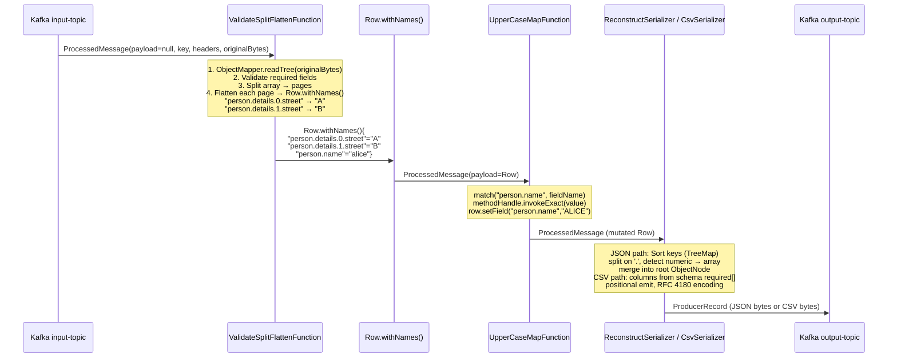

# Apache Flink 1.20.3 Hierarchical JSON Flattening Pipeline

---

## 1. Mermaid Architecture Diagram

```mermaid
flowchart TD
    subgraph KAFKA_IN["Kafka Cluster (Source)"]
        KT1[("input-topic\npartitions: N")]
        KT2[("dlq-topic\nparse / validation failures")]
    end

    subgraph KAFKA_OUT["Kafka Cluster (Sink)"]
        KT3[("output-topic (JSON)\npartitions: N")]
        KT4[("output-topic (CSV)\noptional flat format")]
    end

    subgraph FLINK["Flink Job: JsonFlattenPipeline (parallelism=P)"]
        direction TB

        subgraph INGEST["Ingestion Layer"]
            KC["KafkaEnvelopeDeserializer\n─────────────────\n• KafkaSource (FLIP-27)\n• OffsetsInitializer.committed()\n• EXACTLY_ONCE isolation\n• Captures key + value + headers\n• Emits ProcessedMessage(payload=null)"]
        end

        subgraph CORE["Core Layer (single operator, one JSON parse)"]
            VSF["ValidateSplitFlattenFunction\n(ProcessFunction)\n─────────────────\n• Parse byte[] → JsonNode (once)\n• Validate required top-level fields\n• Validate required array item fields\n• Split array into pages of configurable size\n• Flatten each page → Row.withNames()\n  Objects → parent.child (dot-notation)\n  Arrays  → parent.0.field\n• Reuses ObjectMapper (ThreadLocal)\n• Emits ProcessedMessage(payload=Row)\n• OR side-output DLQ"]
            DLQ_SIDE["Side Output\n(DLQ Tag)"]
        end

        subgraph PROCESS["Processing Layer"]
            RM["UpperCaseMapFunction\n(MapFunction<ProcessedMessage,ProcessedMessage>)\n─────────────────\n• open(): loads vendor JAR via URLClassLoader\n  binds MethodHandle for process(String)\n• map(): match field names against patterns\n  supports wildcard * per dot-segment\n• Applies processor to matching String fields\n• Returns ProcessedMessage with mutated Row"]
        end

        subgraph SERIALIZE["Serialize Layer"]
            RS["ReconstructSerializer\n(KafkaRecordSerializationSchema)\n─────────────────\n• Iterates Row.getFieldNames()\n• Sort keys (TreeMap) → parent before child\n• Split key on '.'\n• Detect numeric segment → ArrayNode\n• Recursively builds ObjectNode tree\n• writeValueAsBytes()\n• Propagates Kafka key + headers"]
            CSV["CsvSerializer\n(KafkaRecordSerializationSchema)\n─────────────────\n• Schema loaded via SchemaAnalyzer\n  .loadSchema() + .extractCsvColumns()\n• required[] array = ordered column list\n• All columns mandatory (no optionals)\n• RFC 4180: quote fields containing , \" \\n\n• Propagates Kafka key + headers"]
        end

        subgraph CHECKPOINT["Fault Tolerance"]
            CP["CheckpointingConfig\n─────────────────\n• Mode: EXACTLY_ONCE\n• Interval: 60s\n• Timeout: 120s\n• Min pause: 30s\n• Max concurrent: 1\n• Unaligned: true\n• Storage: FileSystemCheckpointStorage"]
        end
    end

    KT1 -->|"byte[] (Kafka record)"| KC
    KC  -->|"ProcessedMessage(payload=null)"| VSF
    VSF -->|"ProcessedMessage(payload=Row)"| RM
    VSF -->|"DlqRecord"| DLQ_SIDE
    DLQ_SIDE -->|"original bytes + error"| KT2
    RM  -->|"ProcessedMessage (mutated Row)"| RS
    RM  -->|"ProcessedMessage (mutated Row)"| CSV
    RS  -->|"ProducerRecord<bytes> (JSON)"| KT3
    CSV -->|"ProducerRecord<bytes> (CSV)"| KT4
    CP -.->|"barrier injection"| KC
    CP -.->|"state snapshot"| VSF

    style FLINK fill:#1a1a2e,stroke:#4a90d9,color:#fff
    style KAFKA_IN fill:#0d3b66,stroke:#4a90d9,color:#fff
    style KAFKA_OUT fill:#0d3b66,stroke:#4a90d9,color:#fff
    style INGEST fill:#16213e,stroke:#4a90d9,color:#fff
    style CORE fill:#16213e,stroke:#e94560,color:#fff
    style PROCESS fill:#16213e,stroke:#f5a623,color:#fff
    style SERIALIZE fill:#16213e,stroke:#7ed321,color:#fff
    style CHECKPOINT fill:#16213e,stroke:#9b59b6,color:#fff
```

---

## 2. Data Flow & Type Contract



---

## 3. Flattening Algorithm — Pseudocode

```
ALGORITHM: flattenIterative(JsonNode root, Row out)
═══════════════════════════════════════════════════════════════════════════

INPUT:  root — root JsonNode (ObjectNode | ArrayNode | ValueNode)
        out  — Flink Row.withNames() (insertion-ordered LinkedHashMap internally)

OUTPUT: out populated with dot-notation key → scalar value fields

────────────────────────────────────────────────────────────────────────

PROCEDURE flattenIterative(root, out):
  stack ← new ArrayDeque<Object[]>
  stack.push(["", root])

  WHILE stack IS NOT EMPTY:
    [prefix, node] ← stack.pop()

    IF node IS ObjectNode THEN
      children ← []
      FOR EACH (key, child) IN node.fields():
        childKey ← IF prefix IS EMPTY THEN key ELSE prefix + "." + key
        children.add([childKey, child])
      // Push in reverse to preserve document order on pop
      FOR i FROM children.size()-1 DOWN TO 0:
        stack.push(children[i])

    ELSE IF node IS ArrayNode THEN
      FOR i FROM node.size()-1 DOWN TO 0:
        childKey ← prefix + "." + i
        stack.push([childKey, node.get(i)])

    ELSE  // leaf node
      value ← extractLeafValue(node)
      APPLY nullHandling policy
      out.setField(prefix, value)

────────────────────────────────────────────────────────────────────────

LEAF VALUE EXTRACTION:
  integral number fitting int  → Integer
  integral number fitting long → Long
  floating point (BigDecimal)  → BigDecimal
  floating point               → Double
  boolean                      → Boolean
  null / missing               → null
  text                         → String

EXAMPLE TRACE:
  Input: {"person":{"name":"alice","details":[{"street":"A"},{"street":"B"}]}}

  stack: [("", ROOT)]
  pop ("", ROOT) → ObjectNode → push [("person", person_obj)]
  pop ("person", person_obj) → ObjectNode → push [("person.name","alice"), ("person.details", arr)]
  pop ("person.name","alice") → leaf → out["person.name"] = "alice"
  pop ("person.details", arr) → ArrayNode → push [("person.details.1",{B}), ("person.details.0",{A})]
  pop ("person.details.0",{A}) → ObjectNode → push [("person.details.0.street","A")]
  pop ("person.details.0.street","A") → leaf → out["person.details.0.street"] = "A"
  pop ("person.details.1",{B}) → ... → out["person.details.1.street"] = "B"
```

---

## 4. CSV Serialization / Deserialization

```
CSV SCHEMA CONTRACT
═══════════════════
A CSV schema is a standard JSON Schema where:
  - "required" array defines ALL columns and their ORDER
  - Every key in "properties" must appear in "required" (no optional columns)
  - Column names may use dot-notation to reference flat Row fields

Example:
  {
    "required": ["firstName", "lastName", "age", "address.street"],
    "properties": {
      "firstName":      { "type": "string"  },
      "lastName":       { "type": "string"  },
      "age":            { "type": "integer" },
      "address.street": { "type": "string"  }
    }
  }

SchemaAnalyzer.loadSchema(path) + SchemaAnalyzer.extractCsvColumns(schema)
  → immutable List<String>  (the ordered column list)
  Stored in the operator, serialized with job graph — no file I/O on workers.

────────────────────────────────────────────────────────────────────────

ALGORITHM: toCsvLine(Row row, List<String> columns)
═══════════════════════════════════════════════════
  FOR i IN 0..columns.size()-1:
    IF i > 0: append ','
    value ← row.getField(columns[i])   // null if absent
    append encodeCsvField(value)

encodeCsvField(value):
  IF value IS null → ""
  s ← value.toString()
  IF s contains any of  , " \n \r:
    RETURN '"' + s.replace('"', '""') + '"'
  RETURN s

────────────────────────────────────────────────────────────────────────

ALGORITHM: parseCsvLine(String line) → List<String>
═══════════════════════════════════════════════════
  RFC 4180 iterative parser:
  - Quoted field: strip outer quotes; "" inside → "
  - Unquoted field: read until comma or end
  - Trailing comma → empty final field
  - No trimming of whitespace

  Result mapped positionally: columns[i] → row.setField(columns[i], values[i])
  Empty string → null in Row
  Column count mismatch → DLQ ("dlq-csv")
```

---

## 5. Reconstruction Algorithm — Pseudocode

```
ALGORITHM: reconstruct(Row row) → ObjectNode
═══════════════════════════════════════════════════════════════════════

PROCEDURE reconstruct(row):
  root   ← new ObjectNode
  sorted ← new TreeMap<String,Object>()   // lexicographic order

  FOR name IN row.getFieldNames():
    sorted.put(name, row.getField(name))

  FOR EACH (dotKey, value) IN sorted:
    segments ← splitDotPath(dotKey)       // no regex, single scan
    setNested(root, segments, 0, value)

  RETURN root

────────────────────────────────────────────────────────────────────────

PROCEDURE setNested(ObjectNode current, String[] segs, int idx, Object value):

  seg    ← segs[idx]
  isLast ← (idx == segs.length - 1)

  IF isLast THEN
    current.set(seg, toJsonNode(value))
    RETURN

  nextSeg   ← segs[idx + 1]
  nextIsInt ← all chars of nextSeg are digits

  IF nextIsInt THEN
    arr    ← getOrCreateArray(current, seg)
    arrIdx ← parseInt(nextSeg)
    WHILE arr.size() <= arrIdx:
      arr.addNull()                        // pad gaps with null
    IF idx + 2 == segs.length THEN
      arr.set(arrIdx, toJsonNode(value))   // scalar array element
    ELSE
      IF arr.get(arrIdx) IS NullNode:
        arr.set(arrIdx, new ObjectNode())
      setNested(arr.get(arrIdx) AS ObjectNode, segs, idx+2, value)
  ELSE
    child ← getOrCreateObject(current, seg)
    setNested(child, segs, idx+1, value)

NOTE: TreeMap lexicographic sort guarantees parent paths are visited
      before children, and lower array indices before higher ones.
```

---

## 6. Java Component Specifications

### 6.1 ProcessedMessage — Envelope

```
CLASS: ProcessedMessage implements Serializable
═══════════════════════════════════════════════
FIELDS:
  byte[]              kafkaKey        // original Kafka record key (nullable)
  byte[]              originalBytes   // raw Kafka value — preserved for DLQ
  Map<String,byte[]>  headers         // unmodifiable Kafka headers map
  Row                 payload         // null at source; set by ValidateSplitFlatten

FACTORY:
  static ofValue(byte[] value)        // test helper: no key, no headers, null payload
  static ofPayload(Row payload)       // test helper: no key, no headers

MUTATION:
  ProcessedMessage withPayload(Row)   // returns new instance, preserves metadata
```

### 6.2 ValidateSplitFlattenFunction

```
CLASS: ValidateSplitFlattenFunction
  extends ProcessFunction<ProcessedMessage, ProcessedMessage>
  implements ResultTypeQueryable<ProcessedMessage>
═══════════════════════════════════════════════════════════════
FIELDS:
  InputSchemaInfo  inputSchema        // required fields extracted from schema
  PaginationSchema outputSchema       // pagination field names
  int              pageSize
  NullHandling     nullHandling
  static OutputTag<DlqRecord> DLQ_TAG = new OutputTag<>("dlq-validate-split-flatten"){}
  transient ThreadLocal<ObjectMapper> mapperLocal

processElement(ProcessedMessage msg, ctx, out):
  TRY:
    root ← mapper.readTree(msg.originalBytes)     // parse ONCE
    validate top-level required fields            → DLQ on failure
    validate array item required fields           → DLQ on failure
    FOR each page p IN 0..totalPages-1:
      row ← Row.withNames()
      write pagination metadata fields
      flatten array slice directly into row       // iterative, no recursion
      out.collect(msg.withPayload(row))
  CATCH:
    ctx.output(DLQ_TAG, DlqRecord.of(msg, e))
```

### 6.3 SchemaAnalyzer — Shared Schema Utility

```
CLASS: SchemaAnalyzer (pure static)
════════════════════════════════════

// File loading
loadSchema(String classpathPath) → JsonNode
  Uses ClassLoader.getResourceAsStream()
  Throws IllegalStateException if not found on classpath

// Pagination schema analysis
analyze(JsonNode schemaRoot) → PaginationSchema
  Traverses properties, allOf/anyOf/oneOf, if/then/else, $defs/$ref
  Applies role-detection heuristics for array/index/total/count fields
  Throws IllegalArgumentException if any role cannot be uniquely identified

// CSV column extraction
extractCsvColumns(JsonNode schemaRoot) → List<String>  (immutable)
  Reads "required" array for ordered column list
  Validates all "properties" keys appear in "required"
  Throws IllegalArgumentException on contract violation
```

### 6.4 CsvSerializer

```
CLASS: CsvSerializer
  implements KafkaRecordSerializationSchema<ProcessedMessage>
  implements Serializable
════════════════════════════════════════════════════════════
FIELDS:
  String       outputTopic
  List<String> columns    // immutable; loaded at construction; serialized with graph

CONSTRUCTOR(outputTopic, schemaPath):
  columns ← SchemaAnalyzer.extractCsvColumns(SchemaAnalyzer.loadSchema(schemaPath))

serialize(ProcessedMessage msg, ctx, timestamp):
  csvBytes ← toCsvLine(msg.getPayload()).getBytes(UTF_8)
  propagate msg.kafkaKey + msg.headers → ProducerRecord
  RETURN new ProducerRecord<>(outputTopic, ..., csvBytes)
```

### 6.5 CsvDeserializer

```
CLASS: CsvDeserializer
  extends ProcessFunction<byte[], Row>
  implements ResultTypeQueryable<Row>
════════════════════════════════════════════════════════════
FIELDS:
  List<String> columns    // immutable; loaded at construction; serialized with graph
  static OutputTag<DlqRecord> DLQ_TAG = new OutputTag<>("dlq-csv"){}

CONSTRUCTOR(schemaPath):
  columns ← SchemaAnalyzer.extractCsvColumns(SchemaAnalyzer.loadSchema(schemaPath))

processElement(byte[] bytes, ctx, out):
  IF empty/null → DLQ
  TRY:
    line   ← new String(bytes, UTF_8)
    values ← parseCsvLine(line)              // RFC 4180
    IF values.size() != columns.size() → throw
    row ← Row.withNames()
    FOR i: row.setField(columns[i], values[i].isEmpty() ? null : values[i])
    out.collect(row)
  CATCH: ctx.output(DLQ_TAG, DlqRecord.of(bytes, e))
```

### 6.6 UpperCaseMapFunction

```
CLASS: UpperCaseMapFunction extends RichMapFunction<ProcessedMessage, ProcessedMessage>
══════════════════════════════════════════════════════════════════════════════════════
FIELDS:
  String       jarPath
  List<String> fieldPatterns       // wildcard patterns, e.g. "search_engines.*.imdb.director"
  transient MethodHandle processHandle  // loaded once per subtask, ~10x faster than invoke()

open(Configuration cfg):
  IF jarPath blank: use String::toUpperCase fallback
  ELSE:
    loader ← new URLClassLoader([jarPath], classLoader)
    clazz  ← loader.loadClass(processorClass)
    handle ← MethodHandles.lookup().findVirtual(clazz, "process", ...)
    processHandle ← handle.bindTo(clazz.newInstance())

map(ProcessedMessage msg):
  row ← msg.getPayload()
  FOR field IN row.getFieldNames():
    IF any pattern matches(field) AND row.getField(field) instanceof String:
      row.setField(field, processHandle.invoke(value))
  RETURN msg.withPayload(row)
```

### 6.7 ReconstructSerializer

```
CLASS: ReconstructSerializer
  implements KafkaRecordSerializationSchema<ProcessedMessage>
════════════════════════════════════════════════════════════
FIELDS:
  String outputTopic
  transient ThreadLocal<ObjectMapper> mapperLocal

serialize(ProcessedMessage msg, ctx, timestamp):
  mapper ← mapperLocal.get()
  root   ← mapper.createObjectNode()
  sorted ← new TreeMap<>(row.getFieldNames())
  FOR (key, value) IN sorted:
    setNested(root, splitDotPath(key), 0, value, mapper)
  bytes ← mapper.writeValueAsBytes(root)
  propagate msg.kafkaKey + msg.headers → ProducerRecord
  RETURN new ProducerRecord<>(outputTopic, ..., bytes)
```

### 6.8 FlatRowSerializer — Custom TypeSerializer

```
CLASS: FlatRowSerializer extends TypeSerializer<Row>
════════════════════════════════════════════════════
Wire format per record:
  [rowKind: byte] [fieldCount: int]
  FOR each field:
    [name: UTF] [tag: byte] [value: typed]

Type tags:
  0 = null
  1 = String  (UTF)
  2 = Integer (int)
  3 = Long    (long)
  4 = Double  (double)
  5 = Float   (float)
  6 = Boolean (byte)
  7 = BigDecimal (UTF plain string)

CRITICAL: Avoids Kryo fallback. Integer values survive as Integer;
          Long values survive as Long (no promotion).
```

---

## 7. Pipeline Assembly

```
PROCEDURE buildPipeline(env, config):

  // ── Schema Loading ────────────────────────────────────────────────
  inputSchema  ← InputSchemaInfo.analyze(
                   SchemaAnalyzer.loadSchema("schemas/input-netflix-categories.schema.json"))
  outputSchema ← SchemaAnalyzer.analyze(
                   SchemaAnalyzer.loadSchema("schemas/output-persons-paginated.schema.json"))

  // ── Kafka Source ──────────────────────────────────────────────────
  source ← KafkaSource.<ProcessedMessage>builder()
    .setDeserializer(new KafkaEnvelopeDeserializer())
    .setProperty("isolation.level", "read_committed")    // EOS
    .build()

  rawStream ← env.fromSource(source, noWatermarks, "kafka-source")

  // ── Validate + Split + Flatten (single parse) ─────────────────────
  flatStream ← rawStream.process(
    new ValidateSplitFlattenFunction(inputSchema, outputSchema, pageSize, nullHandling))

  // ── DLQ Side Output ───────────────────────────────────────────────
  flatStream.getSideOutput(ValidateSplitFlattenFunction.DLQ_TAG)
    .sinkTo(KafkaSink(dlqTopic, DlqSerializationSchema))

  // ── String Processing ─────────────────────────────────────────────
  processedStream ← flatStream.map(new UpperCaseMapFunction(config))

  // ── JSON Output (EXACTLY_ONCE) ────────────────────────────────────
  processedStream.sinkTo(KafkaSink(outputTopic, ReconstructSerializer, EXACTLY_ONCE))

  // ── CSV Output (optional alternative) ────────────────────────────
  // processedStream.sinkTo(KafkaSink(csvTopic, CsvSerializer, EXACTLY_ONCE))
```

---

## 8. Bottleneck Analysis & Mitigations

```
┌─────────────────────────────┬───────────────────────────────┬──────────────────────────────────────┐
│ Bottleneck                  │ Root Cause                    │ Mitigation                           │
├─────────────────────────────┼───────────────────────────────┼──────────────────────────────────────┤
│ Deep nesting (>10 levels)   │ O(depth) recursion stack      │ Iterative flatten with explicit       │
│                             │ large maps, GC pressure        │ Deque<(node,prefix)> — implemented   │
├─────────────────────────────┼───────────────────────────────┼──────────────────────────────────────┤
│ Large arrays (>1000 items)  │ N entries per array element   │ Configurable pageSize splits large    │
│                             │ in Row fields (memory)        │ arrays; each page is bounded          │
├─────────────────────────────┼───────────────────────────────┼──────────────────────────────────────┤
│ splitDotPath() in hot path  │ Called per key in serialize   │ Custom scan (no regex); single pass  │
│                             │ (string allocation)           │ counting + splitting                  │
├─────────────────────────────┼───────────────────────────────┼──────────────────────────────────────┤
│ ObjectMapper allocation     │ Per-record JSON parse         │ ThreadLocal<ObjectMapper> — done.    │
├─────────────────────────────┼───────────────────────────────┼──────────────────────────────────────┤
│ Reflective Method.invoke()  │ Per-record in map function    │ MethodHandle.bindTo() resolved once; │
│                             │                               │ ~10x faster after JIT warm-up        │
├─────────────────────────────┼───────────────────────────────┼──────────────────────────────────────┤
│ EOS transaction overhead    │ Kafka 2PC per checkpoint      │ Tune checkpoint interval ≥60s;       │
│                             │ adds latency spikes            │ use unaligned checkpoints            │
├─────────────────────────────┼───────────────────────────────┼──────────────────────────────────────┤
│ Skewed partitions           │ Hot keys in Kafka topic       │ Add rebalance() before core operator │
│                             │ → uneven subtask load         │ or keyBy(hash(offset % P))           │
├─────────────────────────────┼───────────────────────────────┼──────────────────────────────────────┤
│ Checkpoint state size       │ Row maps accumulate           │ Operator is stateless (no keyed      │
│                             │ in buffer during barrier       │ state); checkpoint only Kafka offset │
└─────────────────────────────┴───────────────────────────────┴──────────────────────────────────────┘
```

---

## 9. Configuration Reference

```yaml
job:
  parallelism: 8                        # = Kafka partition count

kafka:
  bootstrap-servers: "broker1:9092,broker2:9092"
  input-topic: input-topic
  output-topic: output-topic
  dlq-topic: dlq-topic
  consumer-group: flink-json-flatten-cg

checkpoint:
  interval-ms: 60000
  timeout-ms: 120000
  min-pause-ms: 30000
  storage: s3://my-bucket/flink-checkpoints/json-flatten
  unaligned: true

processing:
  third-party-jar: /opt/flink/lib/vendor-processor-1.0.0.jar
  processor-class: com.vendor.StringProcessor
  uppercase-field-keys: "search_engines.*.imdb.director,person.name"

splitting:
  page-size: 100

flatten:
  null-handling: INCLUDE                # INCLUDE | EXCLUDE | REPLACE_EMPTY_STRING
```

---

## 10. Key Design Decisions

| Decision | Choice | Rationale |
|---|---|---|
| `Row.withNames()` | Named-field dynamic Row | Schema-agnostic; field count varies per message; O(1) named access |
| `ProcessedMessage` envelope | Immutable wrapper with `withPayload()` | Preserves Kafka key + headers through all operators without mutation |
| Single merged operator | `ValidateSplitFlattenFunction` | Eliminates byte[] round-trip between validate/split/flatten; one JSON parse |
| `SchemaAnalyzer` as shared utility | All schema loading through one class | `loadSchema` + `analyze` + `extractCsvColumns` colocated; no duplication |
| CSV column order from `required` | Standard JSON Schema `required` array | Already ordered; no custom extension needed; same format as JSON schemas |
| Column list serialized with operator | `List<String>` field | No file I/O at worker start-up; survives operator serialization |
| ObjectMapper lifecycle | `ThreadLocal` | Zero allocation per record; thread-safe |
| Array detection | Numeric segment check (no regex) | Unambiguous; no schema metadata needed; custom scan avoids regex overhead |
| DLQ mechanism | Flink Side Output | No job failure; same parallelism; no extra network hop |
| EOS boundary | Kafka `read_committed` + `EXACTLY_ONCE` | Full end-to-end guarantee across both topics |
| `MethodHandle` for vendor processor | Bound once per subtask in `open()` | ~10× faster than `Method.invoke()` after JIT warm-up |
| Sort before reconstruct | `TreeMap` (lexicographic) | Guarantees parent path exists before child insert; index 0 before index 1 |
